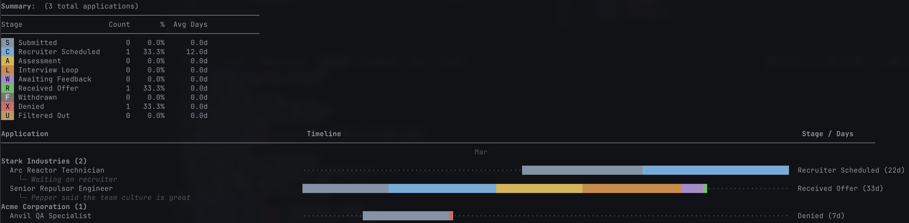

# apptrack

**Your job hunt, visualized.** A terminal-native Gantt chart that turns your job application chaos into a clean, color-coded timeline.



## Why?

Spreadsheets are boring. Notion boards are overkill. You just want to glance at your terminal and know where every application stands — from "Submitted" to "Offer" (or the inevitable "Denied"). `apptrack` renders your entire pipeline as a Gantt chart, right where you already live: the command line.

## Quickstart

**Prerequisites:** Python 3.13+ and [uv](https://docs.astral.sh/uv/)

```sh
# Clone & install
make setup
uv sync

# Run with example data
uv run apptrack --apps applications.example.yaml
```

## Usage

```sh
uv run apptrack --apps applications.yaml
```

| Flag     | Default     | Description               |
| -------- | ----------- | ------------------------- |
| `--flow` | `flow.yaml` | Path to flow config YAML  |
| `--apps` | —           | Path to applications YAML |

## Setting up your data

Create an `applications.yaml` in the project root — see [`applications.example.yaml`](applications.example.yaml) for the format. JSON schemas in `schemas/` provide IDE autocompletion.

Stages are defined in [`flow.yaml`](flow.yaml):

| Flow stages               |                             | Terminal stages        |                      |
| ------------------------- | --------------------------- | ---------------------- | -------------------- |
| **S** — Submitted         | **C** — Recruiter Scheduled | **R** — Received Offer | **U** — Filtered Out |
| **A** — Assessment        | **L** — Interview Loop      | **F** — Withdrawn      | **X** — Denied       |
| **W** — Awaiting Feedback |                             |                        |                      |

## Development

```sh
uv run ruff format app/ main.py tests/  # format
uv run ruff check app/ main.py tests/   # lint
uv run pyright app/ main.py             # type check
uv run pytest                           # test
```
